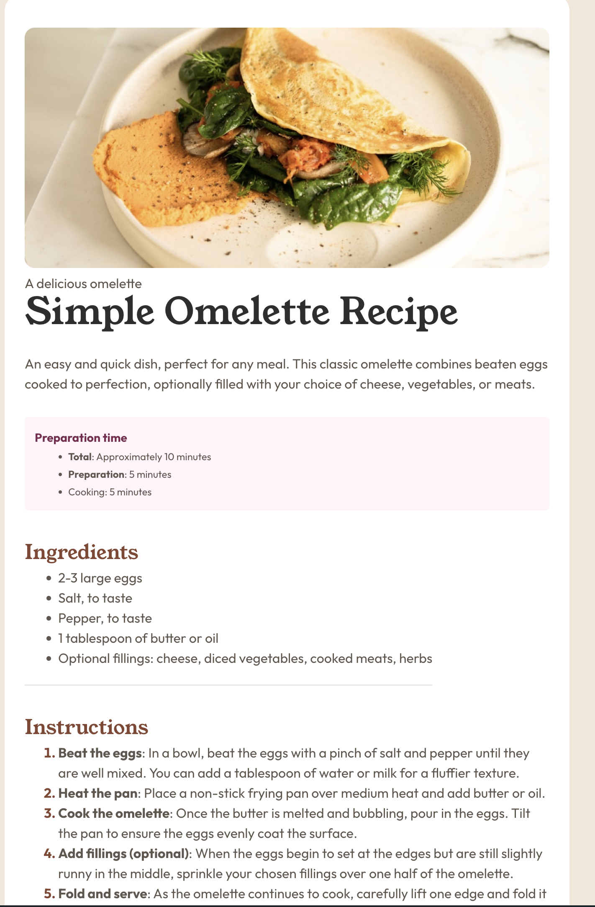

# Frontend Mentor - Recipe page solution

This is a solution to the [Recipe page challenge on Frontend Mentor](https://www.frontendmentor.io/challenges/recipe-page-KiTsR8QQKm). Frontend Mentor challenges help you improve your coding skills by building realistic projects. 

## Table of contents

- [Overview](#overview)
  - [The challenge](#the-challenge)
  - [Screenshot](#screenshot)
  - [Links](#links)
- [My process](#my-process)
  - [Built with](#built-with)
  - [What I learned](#what-i-learned)
- [Author](#author)
- [Acknowledgments](#acknowledgments)
- [License](#license) 

## Overview

### Screenshot

### Links

- Solution URL: [Solution URL](https://github.com/TechEdDan2/RecipePageFM)
- Live Site URL: [Add live site URL here](https://your-live-site-url.com)

## My process
I started with the mobile design first, then worked my way up to the desktop design. I used a combination of flexbox and grid to achieve the desired layout. I used semantic HTML5 elements to structure the content and CSS custom properties for colors and fonts. I also made sure to use a mobile-first workflow to ensure the site is responsive and looks good on all devices.

### Built with

- Semantic HTML5 markup
- CSS custom properties
- Flexbox
- CSS Grid
- Mobile-first workflow

**Note: These are just examples. Delete this note and replace the list above with your own choices**

### What I learned
I learned how to use CSS Grid to create a responsive layout. I also learned how to use CSS custom properties to manage colors and fonts more efficiently. Additionally, I improved my skills in using semantic HTML5 elements to structure the content of the page.

## Author
- Github - [TechEdDan2](https://github.com/TechEdDan2)
- Frontend Mentor - [@TechEdDan2](https://www.frontendmentor.io/profile/TechEdDan2)

## Acknowledgments
The YouTubers and other educational resources I have been learning from include: Coder Coder (Jessica Chan), BringYourOwnLaptop (Daniel Walter Scott), Kevin Powell, vairous Udemy courses, Geeks for Geeks, and Stony Brook University's Software Engineering Bootcamp (Colt Steele) 

## License
This project is licensed under the ISC license
